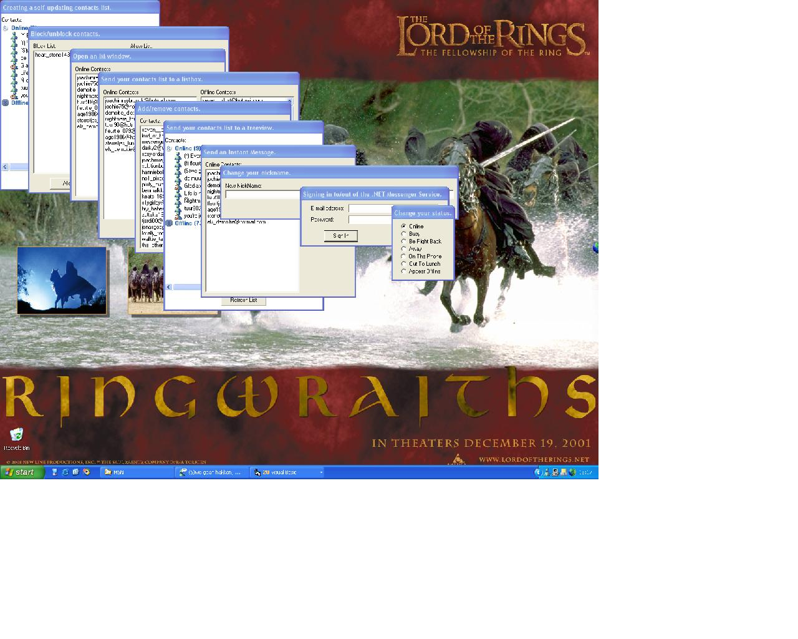



## \_MSN In Visual Basic\_

### Description

This article will cover the most important aspects of programming MSN using Visual Basic.
 
### More Info
 

             |
---                |---
**Submitted On**   |2002-12-17 20:16:04
**By**             |[BelgiumBoy\_007](https://github.com/Planet-Source-Code/PSCIndex/blob/master/ByAuthor/belgiumboy-007.md)
**Level**          |Beginner
**User Rating**    |4.9 (151 globes from 31 users)
**Compatibility**  |VB 3\.0, VB 4\.0 \(16\-bit\), VB 4\.0 \(32\-bit\), VB 5\.0, VB 6\.0
**Category**       |[Miscellaneous](https://github.com/Planet-Source-Code/PSCIndex/blob/master/ByCategory/miscellaneous__1-1.md)
**World**          |[Visual Basic](https://github.com/Planet-Source-Code/PSCIndex/blob/master/ByWorld/visual-basic.md)
**Archive File**   |[\_MSN\_In\_Vi15153412182002\.zip](https://github.com/Planet-Source-Code/belgiumboy-007-msn-in-visual-basic__1-41692/archive/master.zip)

### Source Code

<html>
<head>

<title></title>
</head>
<body link="#0000FF" vlink="#0000FF" alink="#0000FF">
<h1>Programming MSN Messenger using Visual Basic.</h1>
<table width="700">
 <tr>
  <td>This article will cover the more simple actions that can be done.&nbsp; Here is a list
  of the different topics:<ul>
   <li><a href="#intro">Intro.</a></li>
   <li><a href="#whatdoesvisualbasicallowmetodo">What does Visual Basic allow me to do ?</a></li>
   <li><a href="#declaringtheappropriatevariables">Declaring the appropriate variables.</a></li>
   <li><a href="#signinginandoutoftheservice">Signing in to/out of the .NET Messenger Service.</a></li>
   <li><a href="#changeyournickname">Change your nickname.</a></li>
   <li><a href="#changeyourstatus">Change your status.</a></li>
   <li><a href="#sendyourcontactslisttoalistbox">Send your contacts list to a listbox.</a></li>
   <li><a href="#sendyourcontactslisttoatreeview">Send your contacts list to a treeview.</a></li>
   <li><a href="#sendaninstantmessage">Send an Instant Message.</a></li>
   <li><a href="#openanimwindow">Open an IM window.</a></li>
   <li><a href="#blockunblockcontacts">Block/unblock contacts.</a></li>
   <li><a href="#addremovecontacts">Add/remove contacts.</a></li>
   <li><a href="#handlingmsnevents">Handling MSN events.</a></li>
   <li><a href="#creatingaselfupdatingcontactslist">Creating a self-updating contacts list.</a></li>
  </ul>
  
If you want the code for a fully functioning MSN-Bot then click <a
  href="http://www.planet-source-code.com/vb/scripts/ShowCode.asp?txtCodeId=40655&amp;lngWId=1"
  target="_blank">here</a>.</td>
 </tr>
</table>
<h1>Intro.</h1>
<table border="0" width="700">
 <tr>
  <td>So you want to know how to program MSN Messenger using Microsoft Visual Basic? &nbsp;
  Well you've come to the right place.&nbsp; I'll take you thru the basics.&nbsp; I'm going
  to assume that you already know some Visual Basic so I'll concentrate on explaining the
  MSN-related code.&nbsp; I hope this article will help you and if you have any questions
  than please don't hesitate to <a
  href="mailto:webmaster@bartnet.freeservers.com?subject=Question About MSN In Visual Basic">ask
  me</a>.
IMPORTANT : The codes here will not work with the
  new version of MSN Messenger (5.0), only with versions 4.7 or below.&nbsp; The ideal
  version is 4.6.

  
<a href="#top">Back to top</a></td>
 </tr>
</table>
<h1>What does Visual Basic allow me to do ?</h1>
<table border="0" width="700">
 <tr>
  <td>With Visual Basic you can basically do anything that MSN Messenger can do.&nbsp; Al
  you do using Visual Basic is send commands to the MSN program, which is why your program
  will not work if MSN Messenger version 4.7 or below is not running.&nbsp; You do not have
  to be signed in to the .NET Messenger Service but the program must be running.&nbsp; This
  means that you can send/receive Instant Messages, add/remove contacts, change your
  nickname, change your status, go to you e-mail inbox, ...
<a
  href="#top">Back to top</a></td>
 </tr>
</table>
<h1>Declaring the appropriate variables.</h1>
<table border="0" width="700">
 <tr>
  <td>First you have to add the Messenger references to your project.&nbsp; Go to <u>P</u>rojects
  &gt; Prefere<u>n</u>ces... and select the following references:<ul>
   <li>Messenger Type Library
    &nbsp;&nbsp;&nbsp;&nbsp;&nbsp;&nbsp;&nbsp;&nbsp;&nbsp;&nbsp;&nbsp;&nbsp;&nbsp;&nbsp;&nbsp;&nbsp;&nbsp;&nbsp;&nbsp;
    (found at C:\Program Files\Messenger\msmsgs.exe)</li>
   <li>Messenger API Type Library
    &nbsp;&nbsp;&nbsp;&nbsp;&nbsp;&nbsp;&nbsp;&nbsp;&nbsp;&nbsp;&nbsp;&nbsp;&nbsp; (found at
    C:\Program Files\Messenger\msmsgs.exe\3)</li>
   <li>Messenger AddIns Type Library&nbsp;&nbsp;&nbsp;&nbsp;&nbsp;&nbsp;&nbsp;&nbsp; (found at
    C:\Program Files\Messenger\msmsgs.exe\4)</li>
   <li>Messenger Private Type Library&nbsp;&nbsp;&nbsp;&nbsp;&nbsp;&nbsp;&nbsp;&nbsp; (found at
    C:\Program Files\Messenger\msmsgs.exe\2)</li>
  </ul>
  
You most likely won't need all of them but it's best to add them anyway.&nbsp; Now you
  need to declare the standard variable.&nbsp; There are 2 that we will be using in this
  tutorial, the second one can be declared in two different ways.&nbsp; The first one is a
  variable using the API Type Library.&nbsp; We'll call it MSNAPI:

  <pre>Private MSNAPI As New MessengerAPI.Messenger</pre>
  
The second one will use the Messenger Type Library, we'll call this one MSN:

  <pre>Private MSN As New MsgrObject</pre>
  
with both of these declarations you can leave out the New
  but then you'll have to add this to your code:

  <pre>Private Sub Form_Load()
   Set MSN = New MsgrObject
  Set MSNAPI = New MessengerAPI.Messenger
End Sub</pre>
  
Why would we use the second method ?&nbsp; Simple, when we want to add the WithEvents
  option we have to leave it out.&nbsp; Most of the time you are going to be using the
  second method because then you can keep track of what's happening in MSN and even block
  most of the events.&nbsp; Then the declaration would look like this:

  <pre>Private WithEvents MSN As MsgrObject
Private WithEvents MSNAPI As MessengerAPI.Messenger</pre>
  
But for this article we will use the first method simply because it's shorter.

  
<a href="#top">Back to top</a></td>
 </tr>
</table>
<h1>Signing in to/out of the .NET Messenger
Service.</h1>
<table border="0" width="700">
 <tr>
  <td>This is very simple.&nbsp; Create a new project, add the references and on the form
  put 2 Labels (lblUserEmail &amp; lblPassword), 2 TextBoxes (txtUserEmail &amp;
  txtPassword) and 2 CommandButtons (cmdSignIn &amp; cmdSignOut).&nbsp; Now enter the
  following code:<pre>Private MSN As New MsgrObject
Private Sub cmdSignIn_Click()
On Error Resume Next
  MSN.Logon txtUserEmail.Text, txtPassword.Text, MSN.Services.PrimaryService
End Sub
Private Sub cmdSignOut_Click()
On Error Resume Next
  MSN.Logoff
End Sub</pre>
  
As you can see it isn't hard at all.&nbsp; I've put in error handling because if you
  try to Sign In when you are already signed in you will get an error and the same with
  signing out.

  
The code for this example can be found in folder number 1.

  
<a href="#top">Back to top</a></td>
 </tr>
</table>
<h1>Change your nickname.</h1>
<table border="0" width="700">
 <tr>
  <td>It only takes one line of code but unfortunately because you are using the running MSN
  Messenger program you can't change your nickname to everything you want.&nbsp; Rude words,
  websites and some other words will not work.&nbsp; Create a new project, add the
  references and on the form put a Label (lblNewNickName), a TextBox (txtNewNickName) and a
  CommandButton (cmdChangeNickName).&nbsp; Enter the following code:<pre>Private MSN As New MsgrObject
Private Sub cmdChangeNickName_Click()
  If MSN.LocalState = MSTATE_OFFLINE Then
    MsgBox &quot;You are not Signed In&quot;
  Else
    MSN.Services.PrimaryService.FriendlyName = txtNewNickName.Text
    txtNewNickName.Text = &quot;&quot;
  End If
End Sub</pre>
  
You may have noticed that the following also exists:

  <pre>MSN.LocalFriendlyName</pre>
  
This is read only so it will not work.&nbsp; When a user presses the button then first
  the program will make sure that you are Signed In and if you aren't it will give a Message
  Box.

  
The code for this example can be found in folder number 2.

  
<a href="#top">Back to top</a></td>
 </tr>
</table>
<h1>Change your status.</h1>
<table border="0" width="700">
 <tr>
  <td>This is also very easy.&nbsp; Create a new project, add the references and on the form
  put 7 OptionButtons (optOnline, optBusy, optBeRightBack, optAway, optOnThePhone,
  optOutToLunch &amp; optAppearOffline).&nbsp; Next, insert the following code:<pre>Private MSN As New MsgrObject
Private Sub Form_Load()
  Select Case MSN.LocalState
    Case MSTATE_ONLINE
      optOnline.Value = True
    Case MSTATE_BUSY
      optBusy.Value = True
    Case MSTATE_BE_RIGHT_BACK
      optBeRightBack.Value = True
    Case MSTATE_AWAY
      optAway.Value = True
    Case MSTATE_ON_THE_PHONE
      optOnThePhone.Value = True
    Case MSTATE_OUT_TO_LUNCH
      optOutToLunch.Value = True
    Case MSTATE_INVISIBLE
      optAppearOffline.Value = True
  End Select
End Sub
Private Sub optAppearOffline_Click()
  MSN.LocalState = MSTATE_INVISIBLE
End Sub
Private Sub optAway_Click()
  MSN.LocalState = MSTATE_AWAY
End Sub
Private Sub optBeRightBack_Click()
  MSN.LocalState = MSTATE_BE_RIGHT_BACK
End Sub
Private Sub optBusy_Click()
  MSN.LocalState = MSTATE_BUSY
End Sub
Private Sub optOnline_Click()
  MSN.LocalState = MSTATE_ONLINE
End Sub
Private Sub optOnThePhone_Click()
  MSN.LocalState = MSTATE_ON_THE_PHONE
End Sub
Private Sub optOutToLunch_Click()
  MSN.LocalState = MSTATE_OUT_TO_LUNCH
End Sub</pre>
  
When you run the program it will first check what your status is and set the
  appropriate OptionButton value to true.&nbsp; Then depending on which OptionButton has
  been clicked it will change your status.&nbsp; Here's a list of all of the MSN.LocalState
  constants:<ul>
   <li>MSTATE_AWAY</li>
   <li>MSTATE_BE_RIGHT_BACK</li>
   <li>MSTATE_BUSY</li>
   <li>MSTATE_IDLE</li>
   <li>MSTATE_INVISIBLE</li>
   <li>MSTATE_LOCAL_CONNECTING_TO_SERVER</li>
   <li>MSTATE_LOCAL_DISCONNECTING_FROM_SERVER</li>
   <li>MSTATE_LOCAL_FINDING_SERVER</li>
   <li>MSTATE_LOCAL_SYNCHRONIZING_WITH_SERVER</li>
   <li>MSTATE_OFFLINE</li>
   <li>MSTATE_ON_THE_PHONE</li>
   <li>MSTATE_ONLINE</li>
   <li>MSTATE_OUT_TO_LUNCH</li>
   <li>MSTATE_UNKNOWN</li>
  </ul>
  
The code for this example can be found in folder number 3.

  
<a href="#top">Back to top</a></td>
 </tr>
</table>
<h1>Send your contacts list to a listbox.</h1>
<table border="0" width="700">
 <tr>
  <td>This is a bit more complicated than the last 3 topics.&nbsp; Create a new project, add
  the references and on the form put 2 Labels (lblOnlineContacts &amp; lblOfflineContacts),
  2 ListBoxes (lstOnlineContacts &amp; lstOfflineContacts) and a CommandButton
  (cmdRefreshList).&nbsp; Now insert the following code:<pre>Private MSN As New MsgrObject
Private Sub RefreshList()
  lstOfflineContacts.Visible = False
  lstOnlineContacts.Visible = False
  Dim User As IMsgrUser
  lstOnlineContacts.Clear
  lstOfflineContacts.Clear
  For Each User In MSN.List(MLIST_CONTACT)
    If User.State = MSTATE_OFFLINE Then
      lstOfflineContacts.AddItem (User.EmailAddress)
    Else
      lstOnlineContacts.AddItem (User.EmailAddress)
    End If
  Next
  lstOfflineContacts.Visible = True
  lstOnlineContacts.Visible = True
End Sub
Private Sub cmdRefreshList_Click()
  If MSN.LocalState &lt;&gt; MSTATE_OFFLINE Then RefreshList
End Sub
Private Sub Form_Load()
  cmdRefreshList_Click
End Sub</pre>
  
The most important part of this code is the RefreshList() sub.&nbsp; Here we first hide
  both the ListBoxes and at the end show them again so there's no flickering.&nbsp; Next we
  declare another variable (User), you can set this variable to any user and get their
  nickname, send a message, ... .&nbsp; In the For - Next loop we go thru all the contacts
  and check their current status.&nbsp; Of they are offline then we add them to the offline
  contacts ListBox, otherwise the offline contacts ListBox.&nbsp; In this code the e-mail
  address of every contact is added to the list but you can also add the nickname of every
  contact, just change User.EmailAddress to User.FriendlyName.

  
The code for this example can be found in folder number 4.

  
<a href="#top">Back to top</a></td>
 </tr>
</table>
<h1>Send your contacts list to a treeview.</h1>
<table border="0" width="700">
 <tr>
  <td>This is the more advanced way of displaying your contacts list, this will look almost
  identical to the way that MSN displays your list.&nbsp; Create a new project, add the
  references, add Microsoft Windows Common Controls 6.0 (SP4) (found in
  C:\Windows\System32\mscomctl.ocx) and on the form put a Label (lblContacts), a TreeView
  (tContacts), a CommandButton (cmdRefreshList) and an ImageList (ilsIcons).&nbsp; Add all
  the picture files found in folder number 5 to the ImageList and use the exact filename
  without the extension as the key (keep in mind that it's case sensitive).&nbsp; Now insert
  the following code into your form:<pre>Private MSN As New MsgrObject
Private Sub RefreshList()
  tContacts.Visible = False
  tContacts.Nodes.Clear
  Dim User As IMsgrUser
  Dim UsersOnline As Integer
  Dim UsersOffline As Integer
  For Each User In MSN.List(MLIST_CONTACT)
    If User.State = MSTATE_OFFLINE Then
      UsersOffline = UsersOffline + 1
    Else
      UsersOnline = UsersOnline + 1
    End If
  Next
  tContacts.Nodes.Add , , &quot;Online&quot;, &quot;Online (&quot; &amp; UsersOnline &amp; &quot;)&quot;, &quot;Up&quot;, &quot;UpSelected&quot;
  With tContacts.Nodes(1)
    .Selected = False
    .Expanded = True
    .Bold = True
    .ForeColor = &amp;H8000000D
    .Sorted = True
  End With
  tContacts.Nodes.Add , , &quot;Offline&quot;, &quot;Offline (&quot; &amp; UsersOffline &amp; &quot;)&quot;, &quot;Down&quot;, &quot;DownSelected&quot;
  With tContacts.Nodes(2)
    .Selected = True
    .Expanded = False
    .Bold = True
    .ForeColor = &amp;H8000000D
    .Sorted = True
  End With
  For Each User In MSN.List(MLIST_ALLOW)
    Select Case User.State
      Case MSTATE_AWAY
        tContacts.Nodes.Add &quot;Online&quot;, tvwChild, User.EmailAddress, User.FriendlyName, &amp; _
        &quot; (Away)&quot;, &quot;Away&quot;, &quot;AwaySelected&quot;
      Case MSTATE_BE_RIGHT_BACK
        tContacts.Nodes.Add &quot;Online&quot;, tvwChild, User.EmailAddress, User.FriendlyName, &amp; _
        &quot; (Be Right Back)&quot;, &quot;Away&quot;, &quot;AwaySelected&quot;
      Case MSTATE_BUSY
        tContacts.Nodes.Add &quot;Online&quot;, tvwChild, User.EmailAddress, User.FriendlyName, &amp; _
        &quot; (Busy)&quot;, &quot;Busy&quot;, &quot;BusySelected&quot;
      Case MSTATE_OFFLINE
        tContacts.Nodes.Add &quot;Offline&quot;, tvwChild, User.EmailAddress, User.FriendlyName, &amp; _
        &quot;Offline&quot;, &quot;OfflineSelected&quot;
      Case MSTATE_ON_THE_PHONE
        tContacts.Nodes.Add &quot;Online&quot;, tvwChild, User.EmailAddress, User.FriendlyName, &amp; _
        &quot; (On The Phone)&quot;, &quot;Busy&quot;, &quot;BusySelected&quot;
      Case MSTATE_ONLINE
        tContacts.Nodes.Add &quot;Online&quot;, tvwChild, User.EmailAddress, User.FriendlyName, &amp; _
        &quot;Online&quot;, &quot;OnlineSelected&quot;
      Case MSTATE_OUT_TO_LUNCH
        tContacts.Nodes.Add &quot;Online&quot;, tvwChild, User.EmailAddress, User.FriendlyName, &amp; _
        &quot; (Out To Lunch)&quot;, &quot;Away&quot;, &quot;AwaySelected&quot;
    End Select
  Next
  For Each User In MSN.List(MLIST_BLOCK)
    If User.State = MSTATE_OFFLINE Then
      tContacts.Nodes.Add &quot;Offline&quot;, tvwChild, User.EmailAddress, User.FriendlyName
      &amp; &quot; (Blocked)&quot;, &quot;Blocked&quot;, &quot;BlockedSelected&quot;
    Else
      tContacts.Nodes.Add &quot;Offline&quot;, tvwChild, User.EmailAddress, User.FriendlyName
      &amp; &quot; (Blocked)&quot;, &quot;Blocked&quot;, &quot;BlockedSelected&quot;
    End If
  Next
  tContacts.Visible = True
End Sub
Private Sub cmdRefreshList_Click()
  RefreshList
End Sub
Private Sub Form_Load()
  RefreshList
End Sub
Private Sub tContacts_NodeClick(ByVal Node As MSComctlLib.Node)
  If Node.Key = &quot;Offline&quot; Or Node.Key = &quot;Online&quot; Then
    If Node.Expanded = True Then
      Node.Expanded = False
      Node.Image = &quot;Down&quot;
      Node.SelectedImage = &quot;DownSelected&quot;
    Else
      Node.Expanded = True
      Node.Image = &quot;Up&quot;
      Node.SelectedImage = &quot;UpSelected&quot;
    End If
  Else
  End If
End Sub</pre>
  
Here the first thing the program will do is see how many of your contacts are online/offline
  and it will add the 2 tags, then it formats the tags to make them look good. &nbsp; After
  that it goes thru all of the contacts and adds them to the list, they will have a
  different caption and image depending on their status.&nbsp; Notice how I put in some code
  to handle the NodeClick event.&nbsp; This is so that the arrow changes from up to down or
  down to up.

  
The code for this example can be found in folder number 5.

  
<a href="#top">Back to top</a></td>
 </tr>
</table>
<h1>Send an Instant Message.</h1>
<table border="0" width="700">
 <tr>
  <td>To do this we will use some of the previous code.&nbsp; Create a new project, add the
  references and on the form put a Label (lblOnlineContacts), a ListBox (lstOnlineContacts)
  and 2 CommandButtons (cmdRefreshList &amp; cmdSendIM).&nbsp; Insert the following code:<pre>Private MSN As New MsgrObject
Private Sub RefreshList()
  lstOnlineContacts.Visible = False
  Dim User As IMsgrUser
  lstOnlineContacts.Clear
  For Each User In MSN.List(MLIST_CONTACT)
    If User.State &lt;&gt; MSTATE_OFFLINE Then lstOnlineContacts.AddItem (User.EmailAddress)
  Next
  lstOnlineContacts.Visible = True
End Sub
Private Sub cmdRefreshList_Click()
  If MSN.LocalState &lt;&gt; MSTATE_OFFLINE Then RefreshList
End Sub
Private Sub cmdSendIM_Click()
  Dim User As IMsgrUser
  Dim bstrMsgHeader As String
  Dim bstrMsgText As String
  If MSN.LocalState = MSTATE_OFFLINE Then
    MsgBox &quot;You are not Signed In&quot;
  Else
    If MSN.LocalState = MSTATE_INVISIBLE Then
      MsgBox &quot;Change you status first !&quot;
    Else
      Set User = MSN.CreateUser(lstOnlineContacts.Text, MSN.Services.PrimaryService)
      bstrMsgText = InputBox(&quot;Enter text to send&quot;, &quot;Send What ?&quot;, &quot;Howdy&quot;, Me.Left, Me.Top)
      User.SendText bstrMsgHeader, bstrMsgText, MMSGTYPE_NO_RESULT
      MsgBox &quot;The following message was sent to &quot; &amp; User.EmailAddress &amp; &quot; : &quot; &amp; bstrMsgText
    End If
  End If
End Sub
Private Sub Form_Load()
  cmdRefreshList_Click
End Sub</pre>
  
First we fill up the ListBox again but we only fill up the one with the online
  contacts, we don't need to know who's offline only who's online.&nbsp; Then when the user
  presses the Send IM button we make sure that we appear to be online to all users and send
  the message.&nbsp; The code is pretty straightforward.

  
The code for this example can be found in folder number 6.

  
<a href="#top">Back to top</a></td>
 </tr>
</table>
<h1>Open an IM window.</h1>
<table border="0" width="700">
 <tr>
  <td>This is the only example where we will use the MSNAPI variable.&nbsp; Because this
  example is almost exactly the same as the previous one I'll only display the change.
  &nbsp; The first change is the gobal variable declaration:<pre>Private MSN As New MsgrObject
Private MSNAPI As New MessengerAPI.Messenger</pre>
  
The second and final change is the cmdSendIM_Click() sub:

  <pre>Private Sub cmdSendIM_Click()
  MSNAPI.InstantMessage (lstOnlineContacts.Text)
End Sub</pre>
  
That's it.

  
The code for this example can be found in folder number 7.

  
<a href="#top">Back to top</a></td>
 </tr>
</table>
<h1>Block/unblock contacts.</h1>
<table border="0" width="700">
 <tr>
  <td>To block or unblock a contact we need to do two things.&nbsp; Remove him from one list
  and add him to the other.&nbsp; Create a new project, add the references and on the form
  put 2 Labels (lblBlock &amp; lblAllow), 2 ListBoxes ( lstBlock &amp; lstAllow) and 3
  CommandButtons (cmdAllow, cmdBlock &amp; cmdRefreshLists).&nbsp; And here's the code:<pre>Private MSN As New MsgrObject
Private Sub RefreshLists()
  lstBlock.Visible = False
  lstAllow.Visible = False
  lstBlock.Clear
  lstAllow.Clear
  Dim User As IMsgrUser
  For Each User In MSN.List(MLIST_BLOCK)
    lstBlock.AddItem (User.EmailAddress)
  Next
  For Each User In MSN.List(MLIST_ALLOW)
    lstAllow.AddItem (User.EmailAddress)
  Next
  lstBlock.Visible = True
  lstAllow.Visible = True
End Sub
Private Sub cmdAllow_Click()
  Dim User As IMsgrUser
  Set User = MSN.CreateUser(lstBlock.Text, MSN.Services.PrimaryService)
  MSN.List(MLIST_ALLOW).Add User
  MSN.List(MLIST_BLOCK).Remove User
  lstAllow.AddItem (lstBlock.Text)
  lstBlock.RemoveItem (lstBlock.ListIndex)
End Sub
Private Sub cmdBlock_Click()
  Dim User As IMsgrUser
  Set User = MSN.CreateUser(lstAllow.Text, MSN.Services.PrimaryService)
  MSN.List(MLIST_ALLOW).Remove User
  MSN.List(MLIST_BLOCK).Add User
  lstBlock.AddItem (lstAllow.Text)
  lstAllow.RemoveItem (lstAllow.ListIndex)
End Sub
Private Sub cmdRefreshLists_Click()
  RefreshLists
End Sub
Private Sub Form_Load()
  RefreshLists
End Sub</pre>
  
The code isn't really that hard to understand.&nbsp; Make sure you always remember that
  the user you removed from one list has to be added to the other list or your MSN Messenger
  will do weird things when you want to send Instant Messages to that particular person.

  
The code for this example can be found in folder number 8.

  
<a href="#top">Back to top</a></td>
 </tr>
</table>
<h1>Add/remove contacts.</h1>
<table border="0" width="700">
 <tr>
  <td>Create a new project, add the references and on the form put a Label (lblContacts), a
  ListBox (lstContacts) and 3 CommandButtons (cmdAddContact, cmdRemoveContact &amp;
  cmdRefreshList).&nbsp; Now insert the following code:<pre>Private MSN As New MsgrObject
Private Sub RefreshList()
  lstContacts.Visible = False
  lstContacts.Clear
  Dim User As IMsgrUser
  For Each User In MSN.List(MLIST_CONTACT)
    lstContacts.AddItem (User.EmailAddress)
  Next
  lstContacts.Visible = True
End Sub
Private Sub cmdAddContact_Click()
  Dim User As IMsgrUser
  Set User = MSN.CreateUser(InputBox(&quot;Enter users e-mail address.&quot;, &quot;Add Contact&quot;, &quot;&quot;, Me.Left, Me.Top), _
  MSN.Services.PrimaryService)
  MSN.List(MLIST_CONTACT).Add User
  MSN.List(MLIST_ALLOW).Add User
  lstContacts.AddItem User.EmailAddress
End Sub
Private Sub cmdRefreshList_Click()
  RefreshList
End Sub
Private Sub cmdRemoveContact_Click()
On Error Resume Next
  Dim User As IMsgrUser
  Set User = MSN.CreateUser(lstContacts.Text, MSN.Services.PrimaryService)
  MSN.List(MLIST_ALLOW).Remove User
  MSN.List(MLIST_CONTACT).Remove User
  MSN.List(MLIST_BLOCK).Remove User
  lstContacts.RemoveItem (lstContacts.ListIndex)
End Sub
Private Sub Form_Load()
  RefreshList
End Sub</pre>
  
First we add all of our contacts to the ListBox.&nbsp; Then when a user wants to add a
  contact they get an InputBox to enter the user's e-mail address into.&nbsp; We set the
  User variable to that e-mail address and add it to the allow and contact list.&nbsp; Then
  we add it to the ListBox.&nbsp;&nbsp; When removing a contact we must make sure we remove
  the User object from whatever list it might be on, we don't know if that particular
  contact is blocked or not.&nbsp; Don't forget the error handling as we will get an error
  because the contact is either on the allow or block list, not both.&nbsp; Then finally we
  remove the user from the ListBox.

  
The code for this example can be found in folder number 9.

  
<a href="#top">Back to top</a></td>
 </tr>
</table>
<h1>Handling MSN events.</h1>
<table border="0" width="700">
 <tr>
  <td>This particular topic doesn't have a project to go along with it.&nbsp; I'm going to
  take you thru the most important MSN events and explain how to use them.&nbsp; The
  following topic is an example of how to use the MSN events in your program.<pre>Private Sub msn_OnListAddResult(ByVal hr As Long, ByVal MLIST As Messenger.MLIST, ByVal pUser As _
  Messenger.IMsgrUser)
End Sub</pre>
  
This will happen when a user is added to any one of the 4 lists.&nbsp; This is
  important so you can update your contacts list, when a user is blocked he or she will be
  ADDED to the block list.&nbsp; pUser tells you which user was added to the list and MLIST
  specifies which list the user was added to.

  <pre>Private Sub msn_OnListRemoveResult(ByVal hr As Long, ByVal MLIST As Messenger.MLIST, ByVal pUser As _
  Messenger.IMsgrUser)
End Sub</pre>
  
This will happen when a user is removed from any one of the 4 lists.&nbsp; This is also
  important so you can update your contacts list, when a user is unblocked he or she will be
  REMOVED from the block list.&nbsp; pUser tells you which user was removed from the list
  and MLIST specifies which list the user was removed from.

  <pre>Private Sub msn_OnLocalFriendlyNameChangeResult(ByVal hr As Long, ByVal pService As _
  Messenger.IMsgrService, ByVal bstrPrevFriendlyName As String)
End Sub</pre>
  
This will happen when your nickname has been changed.&nbsp; pService specifies the
  service you are currently connected to and bstrPrevFriendlyName tells you what your
  nickname was before it was changed.

  <pre>Private Sub msn_OnLocalStateChangeResult(ByVal hr As Long, ByVal mLocalState As _
  Messenger.MSTATE, ByVal pService As Messenger.IMsgrService)
End Sub</pre>
  
This will happen when your state has been changed.&nbsp; mLocalState tells you what
  your current state is and pService specifies the service you are connected to.

  <pre>Private Sub msn_OnLogoff()
End Sub</pre>
  
I don't think I need to explain this one.&nbsp; Just keep in mind that if the user
  exits MSN that this event will not be triggered, only if he or she shuts down his or her
  computer or if they just Sign Out.

  <pre>Private Sub msn_OnLogonResult(ByVal hr As Long, ByVal pService As Messenger.IMsgrService)
End Sub</pre>
  
This will happen when the user has successfully Signed In.&nbsp; pService tells you
  which service the user Signed In to.

  <pre>Private Sub msn_OnTextReceived(ByVal pIMSession As Messenger.IMsgrIMSession, ByVal _
  pSourceUser As Messenger.IMsgrUser, ByVal bstrMsgHeader As String, ByVal bstrMsgText As _
  String, pfEnableDefault As Boolean)
End Sub</pre>
  
This will happen when the user receives text.&nbsp; This could mean 2 things :

  
1) Someone has said something to the user.

  
2) Someone has started to type something to the user but has not yet sent it.

  
pIMSession tells you which session the event has been sent to, pSourceUser tells you
  which user sent the text, bstrMsgHeader contains information regarding the font of the
  text and if it is the second case (see above) this is something else, bstrMsgText lets you
  know which text was sent and pfEnableDefault is used to block the information from going
  to the IM box.&nbsp; If you set pfEnableDefault to False then the user will not receive
  the message.µ

  <pre>Private Sub msn_OnUnreadEmailChanged(ByVal MFOLDER As Messenger.MFOLDER, ByVal cUnreadEmail _
  As Long, pfEnableDefault As Boolean)
End Sub</pre>
  
This will happen when the user receives an e-mail.&nbsp; MFOLDER tells you which folder
  it was sent to (Inbox or not), cUnreadEmail is the amount of unread e-mails in total and
  if you set pfEnableDefault to False the user won't get that popup telling them.

  <pre>Private Sub msn_OnUserFriendlyNameChangeResult(ByVal hr As Long, ByVal pUser As _
  Messenger.IMsgrUser, ByVal bstrPrevFriendlyName As String)
End Sub</pre>
  
This will happen when a user changes his or her nickname.&nbsp; pUser tells you which
  user changed their nickname and bstrPrevFriendlyName tells you what their nickname was
  before they changed it.&nbsp; TIP : to find out what their current nickname is use this :
  pUser.FriendlyName.

  <pre>Private Sub msn_OnUserStateChanged(ByVal pUser As Messenger.IMsgrUser, ByVal mPrevState As _
  Messenger.MSTATE, pfEnableDefault As Boolean)
End Sub</pre>
  
This will happen when a user changes his or her status.&nbsp; pUser tells you which
  user changed their status and mPrevState tells you what their status was before they
  changed it.

  
<a href="#top">Back to top</a></td>
 </tr>
</table>
<h1>Creating a self-updating contacts
list.</h1>
<table border="0" width="700">
 <tr>
  <td>To do this we're just going to make a few minor adjustments to a previous project, the
  one that <a href="#sendyourcontactslisttoatreeview">sends your contact list to a treeview</a>.
  &nbsp; The first change we'll make is the variable declaration, this is what it should
  look like now:<pre>Private WithEvents MSN As MsgrObject</pre>
  
The second change is the Form_Load() sub, it should look like this:

  <pre>Private Sub Form_Load()
  Set MSN = New MsgrObject
  RefreshList
End Sub</pre>
  
Then finally we have to add the following:

  <pre>Private Sub MSN_OnUserStateChanged(ByVal pUser As Messenger.IMsgrUser, ByVal mPrevState As _
  Messenger.MSTATE, pfEnableDefault As Boolean)
  RefreshList
End Sub</pre>
  
That's it.

  
The code for this example can be found in folder number 10.

  
<a href="#top">Back to top</a></td>
 </tr>
</table>
</body>
</html>

